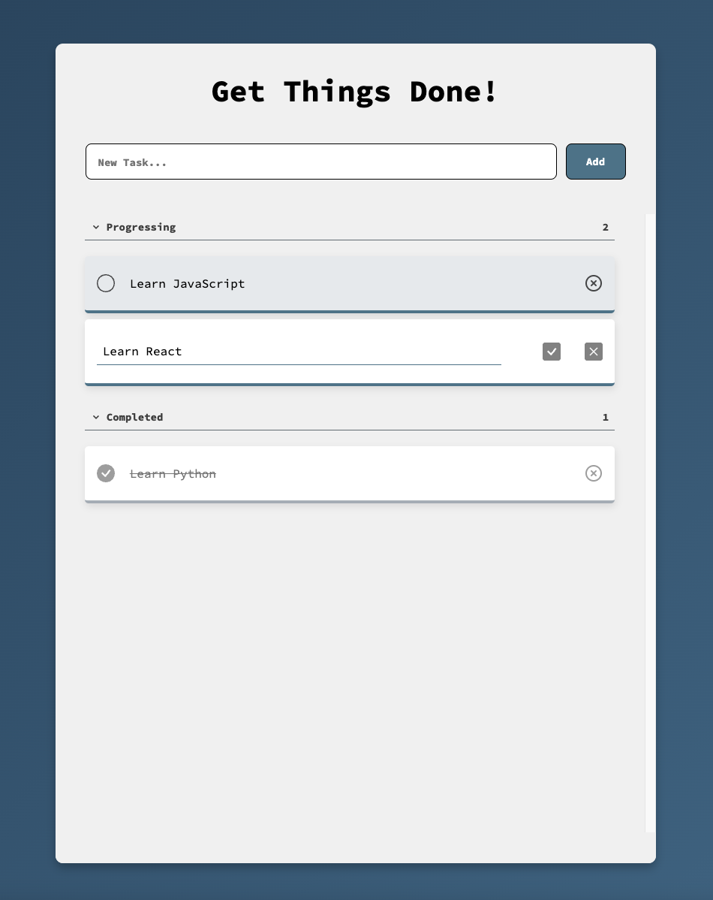
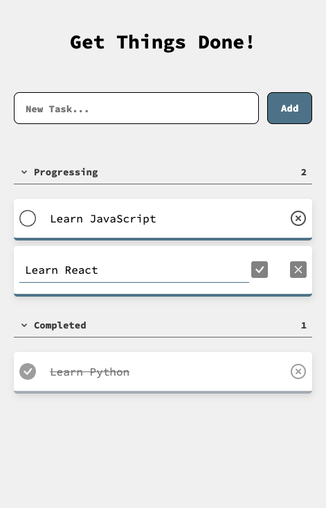

# Project Todo List

This Todo app is created by Sereyvatana Ung from Fireflies team.

The feature that implement in this web app are:
- Create todo
- Mark todo as complete
- Delete todo
- Edit the title of todo
- Browser's local storage

 

# Project Screenshot

 

 

# Project used

- React with Vite
- Browser's local storage
- Google Font: source code pro
- React BoxIcons

# Convention Guide

Convention link click [here](/doc/convention.md)

# User Interface

- [Figma](https://www.figma.com/file/YrH945DXbgdzf7MH1kv6x1/todoproject?type=design&node-id=0-1&mode=design&t=wuLcLRqyAlLtmPhZ-0)

# Note

- My friend Phirom helped me with Convention Guide, Reusable function and Figma design.
- I did the rest with my own and research it from the Internet.
